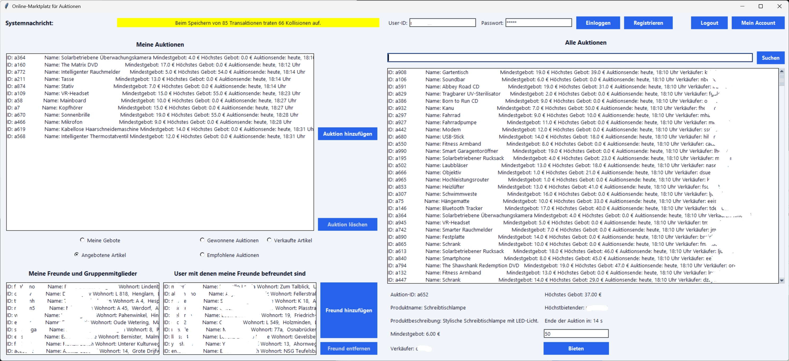
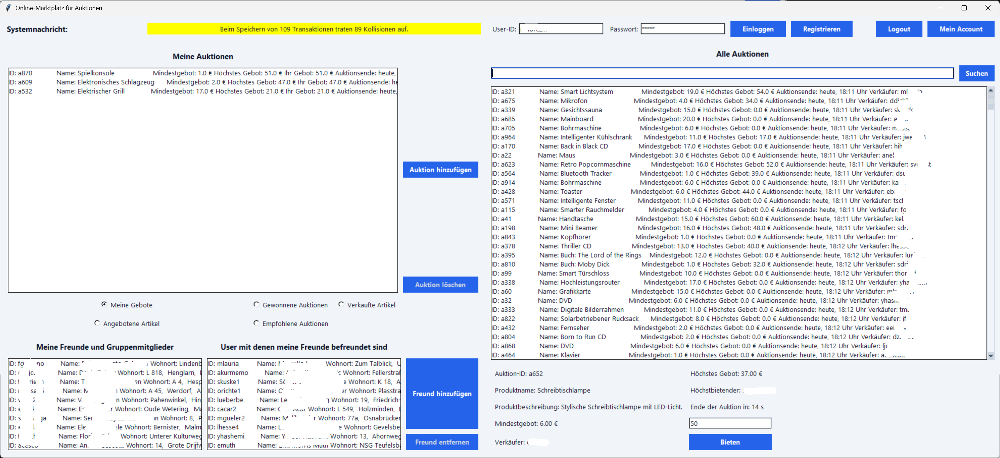
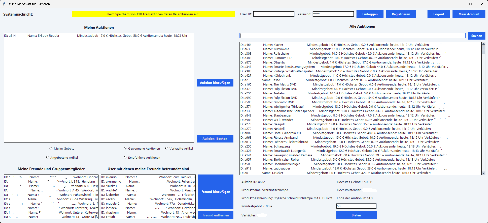
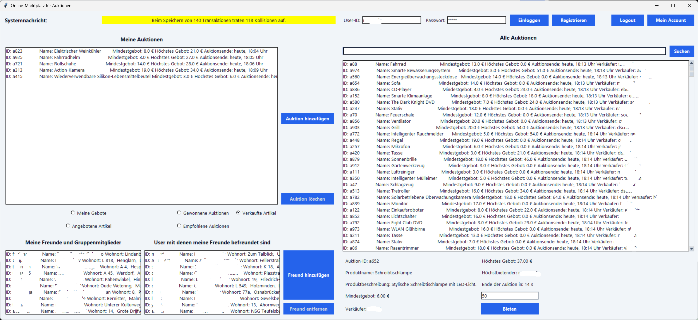
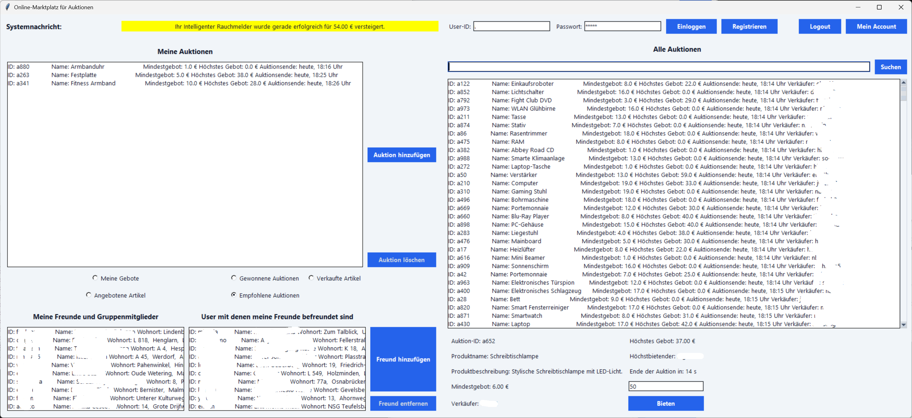
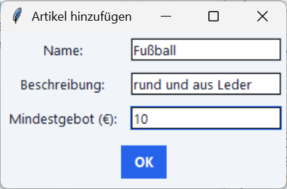
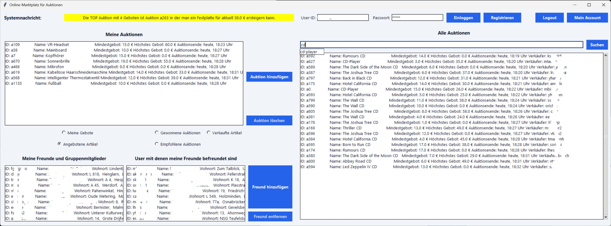

# Benutzerhandbuch zur Benutzeroberfläche (GUI) des Online-Marktplatzes

Willkommen zum Benutzerhandbuch der grafischen Benutzeroberfläche (GUI) des Online-Marktplatzes. Diese Anleitung bietet Studierenden einen Überblick über die wichtigsten Funktionen der Anwendung sowie deren Bedienung.

---

## 1. Anmeldung und Konto-Verwaltung

Im oberen rechten Bereich der Anwendung befindet sich die Leiste zur **Benutzerkonto-Verwaltung**.

* **Login:** Geben Sie Ihre User-ID (z. B. Ihre GM-ID) sowie Ihr Passwort (Standard: `abcde`) ein und klicken Sie auf **Einloggen**.
* **Registrieren:** Falls Sie noch keinen Account besitzen, können Sie über den Button **Registrieren** ein neues Konto mit der eingegebenen User-ID erstellen.
* **Mein Account:** Nach dem Login können Sie über **Mein Account** Ihre Nutzerdaten (User-ID, Name, Passwort sowie aktuelles Guthaben) einsehen.
* **Logout:** Meldet Sie sicher ab und deaktiviert die Marktplatz-Funktionen bis zur nächsten Anmeldung.

---

## 2. Eigene Auktionen und Filteransichten

Im linken Hauptfensterbereich finden Sie den Bereich **Meine Auktionen**. Mithilfe von Radio-Buttons können Sie zwischen verschiedenen Ansichten wechseln:

### Angebotene Artikel

Hier werden alle Auktionen aufgelistet, die Sie aktuell selbst auf dem Marktplatz zum Verkauf anbieten.

### Meine Gebote

Zeigt eine Übersicht aller aktiven Auktionen, auf die Sie mindestens ein Gebot abgegeben haben. Bei Auktionen, bei denen Sie aktuell Höchstbietender sind, wird dies entsprechend markiert.

### Gewonnene Auktionen

Listet alle Auktionen auf, die nach Ablauf der Zeit erfolgreich von Ihnen ersteigert wurden.

### Verkaufte Artikel

Zeigt die von Ihnen angebotenen Artikel an, deren Auktionszeit abgelaufen ist und die erfolgreich an einen Käufer verkauft wurden.

### Empfohlene Auktionen

Basiert auf dem Empfehlungssystem und zeigt Auktionen an, die für Sie basierend auf Ihren bisherigen Aktivitäten oder Interessen von Bedeutung sein könnten.

---

## 3. Auktionen erstellen und löschen

### Neue Auktion hinzufügen

Wenn Sie als Verkäufer aktiv werden möchten, klicken Sie auf **Auktion hinzufügen**. Es öffnet sich ein Pop-up-Fenster:

Geben Sie dort folgende Daten ein:

1. **Name:** Bezeichnung des Produkts.
2. **Beschreibung:** Detaillierte Produktbeschreibung.
3. **Mindestgebot (€):** Startpreis bzw. Mindestgebotsbetrag.

Klicken Sie auf **OK**, um die Auktion zu veröffentlichen.

### Auktion löschen

Wählen Sie in der Liste **Angebotene Artikel** eine Ihrer Auktionen aus und klicken Sie auf **Auktion löschen**. *Hinweis:* Auktionen können nur gelöscht werden, solange noch keine Gebote von anderen Nutzern vorliegen.

---

## 4. Suche und Gebotsabgabe

Im rechten Bereich der Anwendung befindet sich die Übersicht **Alle Auktionen** inklusive Suchfunktion und Detailansicht.

### Produktsuche und Autovervollständigung

* Geben Sie einen Suchbegriff in das Suchfeld ein und klicken Sie auf **Suchen**.
* Während der Eingabe werden Ihnen automatisch Vorschläge aus den verfuegbaren Artikeln eingeblendet (Auto-Vervollständigung).
* Die Auktionsliste wird entsprechend gefiltered angezeigt (z. B. Filterung nach bestimmten Begriffen wie "CD").

### Details einsehen und Bieten

* Wählen Sie eine Auktion aus der Liste **Alle Auktionen** (oder aus Ihren Geboten/Empfehlungen) aus.
* Unterhalb der Liste erscheint das Detailfenster mit Informationen wie Auktions-ID, Produktname, Beschreibung, Verkäufer, Mindestgebot, aktuell hoechstem Gebot, Höchstbietendem und verbleibender Restzeit.
* Tragen Sie den gewünschten Gebotsbetrag in das Feld ein und klicken Sie auf **Bieten**. Das Gebot wird verarbeitet, sofern Ihr Guthaben ausreicht und das Gebot höher als das aktuelle Höchstgebot ist.

---

## 5. Freundesverwaltung und soziale Funktionen

Im linken unteren Bereich befindet sich der Bereich **Meine Freunde und Gruppenmitglieder**.

* **Freund hinzufügen:** Klicken Sie auf **Freund hinzufügen** und geben Sie die User-ID des gewünschten Nutzers ein.
* **Freund entfernen:** Wählen Sie einen Nutzer aus der Freundesliste aus und klicken Sie auf **Freund entfernen**.
* **Freundesempfehlungen:** Auf der rechten Seite der Freundesbox werden Ihnen Nutzer vorgeschlagen ("User mit denen meine Freunde befreundet sind"), um Ihr Netzwerk zu erweitern.
